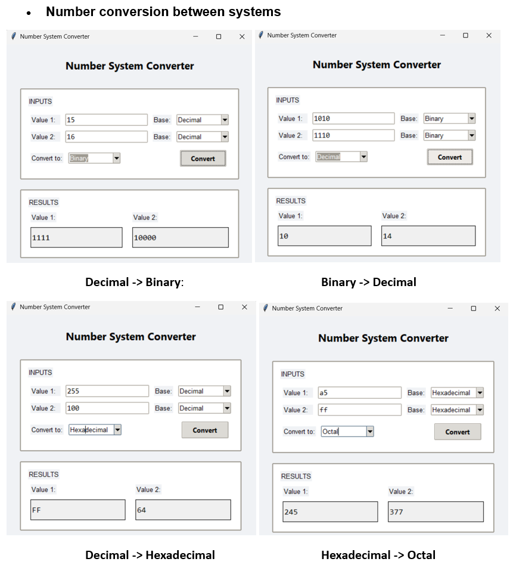
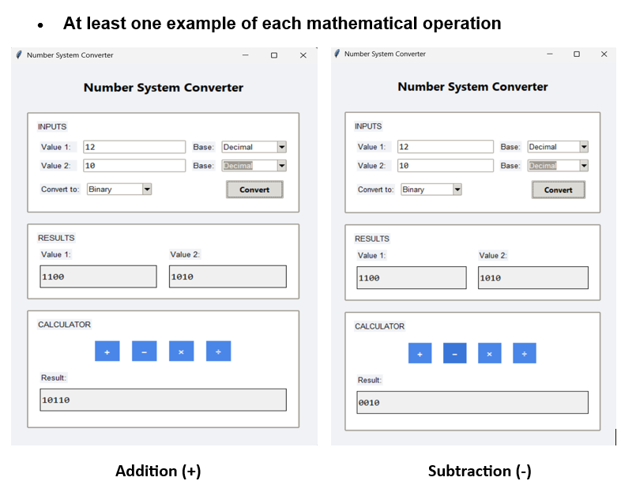

# Number System Conversion Program

## Overview

This is a Number System Converter application built using Python and the Tkinter GUI library. The program allows users to convert numbers between different numeral systems (decimal, binary, octal, and hexadecimal) and perform basic arithmetic operations on the converted values. The interface is organized into three main sections: an input card for entering values and selecting bases, a results card displaying converted values, and a calculator card for performing calculations.

## Features

### Number Conversion Between Systems

The application supports conversion between:

- Decimal (Base 10)
- Binary (Base 2)
- Octal (Base 8)
- Hexadecimal (Base 16)



### Mathematical Operations

The calculator supports the following operations on converted values:

- Addition (+)
- Subtraction (−)



- Multiplication (×)
- Division (÷)


## How to Use

1. Enter your values in the "Value 1" and "Value 2" input fields
2. Select the base system for each input value
3. Choose the target base system you want to convert to
4. Click "Convert" to see the results
5. Use the calculator buttons to perform operations on the converted values

## Requirements

- Python 3.x
- Tkinter (included in standard Python installation)

## Running the Program

```
python number_system_converter.py
```
